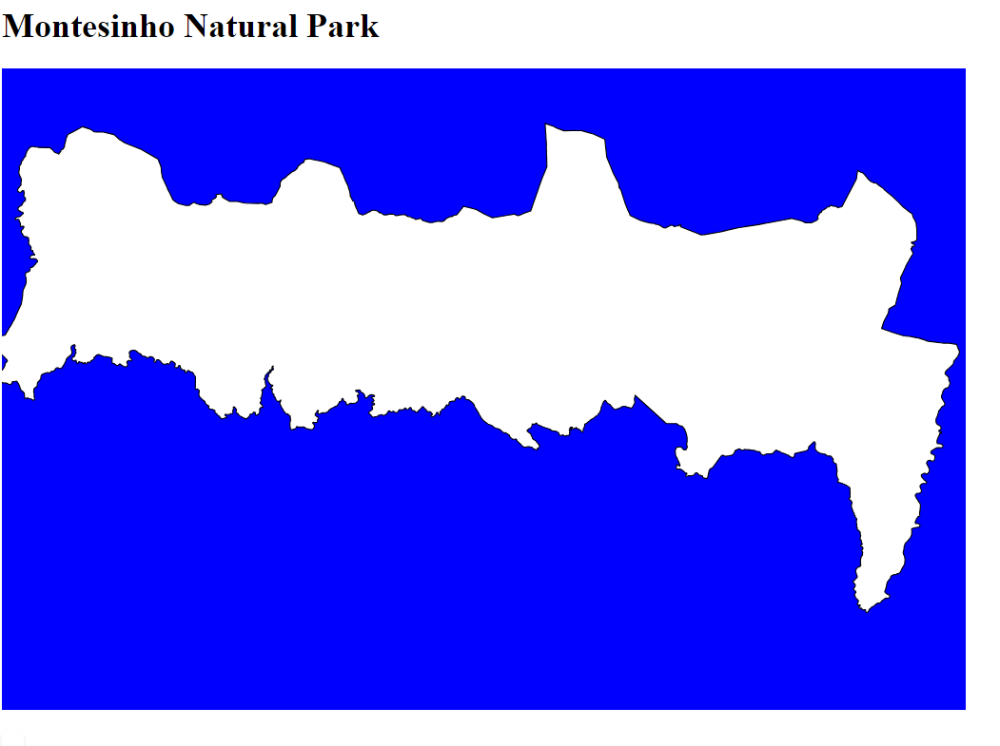
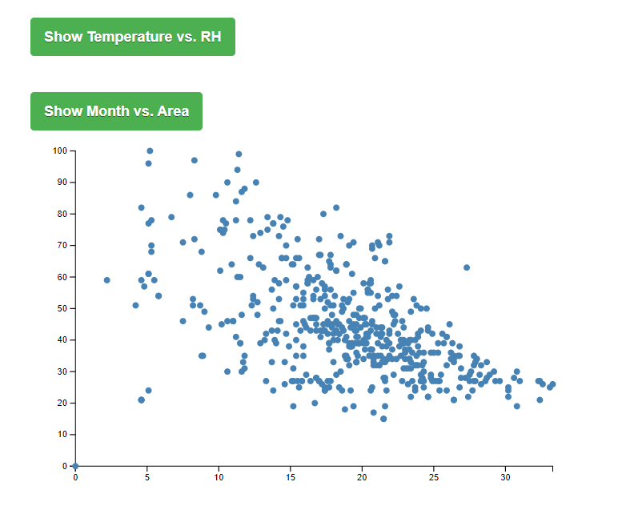
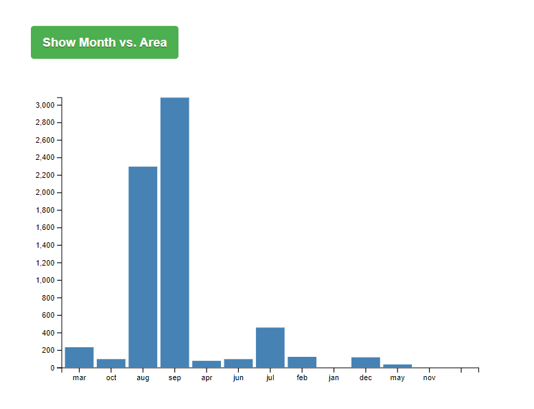

# Data Visualization Project

## Data

The data I propose to visualize for my project is a detailed set of variables from the Montesinho natural park in Portugal, capturing the dynamic interplay between meteorological conditions and forest fires. This dataset includes geographic coordinates denoting fire locations, temporal indicators, critical Fire Weather Index (FWI) components such as the Fine Fuel Moisture Code (FFMC), Duff Moisture Code (DMC), Drought Code (DC), and Initial Spread Index (ISI), as well as key weather observations like temperature, relative humidity, wind speed, and rainfall.  

X	Y	month	day	FFMC	DMC	DC	ISI	temp	RH	wind	rain	area
7	5	mar	fri	86.2	26.2	94.3	5.1	8.2	51	6.7	0	0
7	4	oct	tue	90.6	35.4	669.1	6.7	18	33	0.9	0	0
7	4	oct	sat	90.6	43.7	686.9	6.7	14.6	33	1.3	0	0
8	6	mar	fri	91.7	33.3	77.5	9	8.3	97	4	0.2	0
8	6	mar	sun	89.3	51.3	102.2	9.6	11.4	99	1.8	0	0
8	6	aug	sun	92.3	85.3	488	14.7	22.2	29	5.4	0	0
8	6	aug	mon	92.3	88.9	495.6	8.5	24.1	27	3.1	0	0
8	6	aug	mon	91.5	145.4	608.2	10.7	8	86	2.2	0	0
8	6	sep	tue	91	129.5	692.6	7	13.1	63	5.4	0	0

Dataset Link : https://archive.ics.uci.edu/static/public/162/forest+fires.zip

## Questions & Tasks

The following tasks and questions will drive the visualization and interaction decisions for this project:

  
1). Is there a correlation between temperature and relative humidity?    
    
2). Are there interesting spatial patterns in the occurrence of fires?  
  
3). How does the area burned vary across different months?  

4). How does the Fire Weather Index (FWI) components vary with meteorological conditions(temperature, relative humidity, rain, and wind)?

## Sketches

Line Chart (Temperature over Time): Located at the top left, showing how temperature varies over time.

Scatter Plot (Temperature vs. Relative Humidity): Positioned at the bottom of the line chart, illustrating the relationship between temperature and relative humidity.

Bar Chart (Area Burned by Month): Placed on the right side of the line chart, displaying the total area burned for each month.

Line Chart (Average Wind Speed over Time): Situated below the bar chart, depicting changes in wind speed over time.

## Graphs

The below diagram shows a scatter plot graph and the relationship between humidity and temperature. 

The below diagram shows a scatter plot graph and the relationship between Area and Months. 

## Open Questions

I'm uncertain about the best method to accurately integrate the Fire Weather Index components into the interactive visualizations. Specifically, how to effectively represent the varying scales of the FWI components (FFMC, DMC, DC, ISI, BUI, and FWI) in a manner that is both informative and accessible to users who may not have a background in meteorology or fire science.

## Milestones

Week 1: Data Preparation and Initial Visualization  
Week 2: Enhancing Scatter Plot and Spatial Pattern Analysis  
Week 3: Development of Temporal Analysis and Interaction  
Week 4: FWI Components vs. Meteorological Conditions  
Week 5: Integration and User Experience Improvements  
Week 6: Final Testing and Project Review
