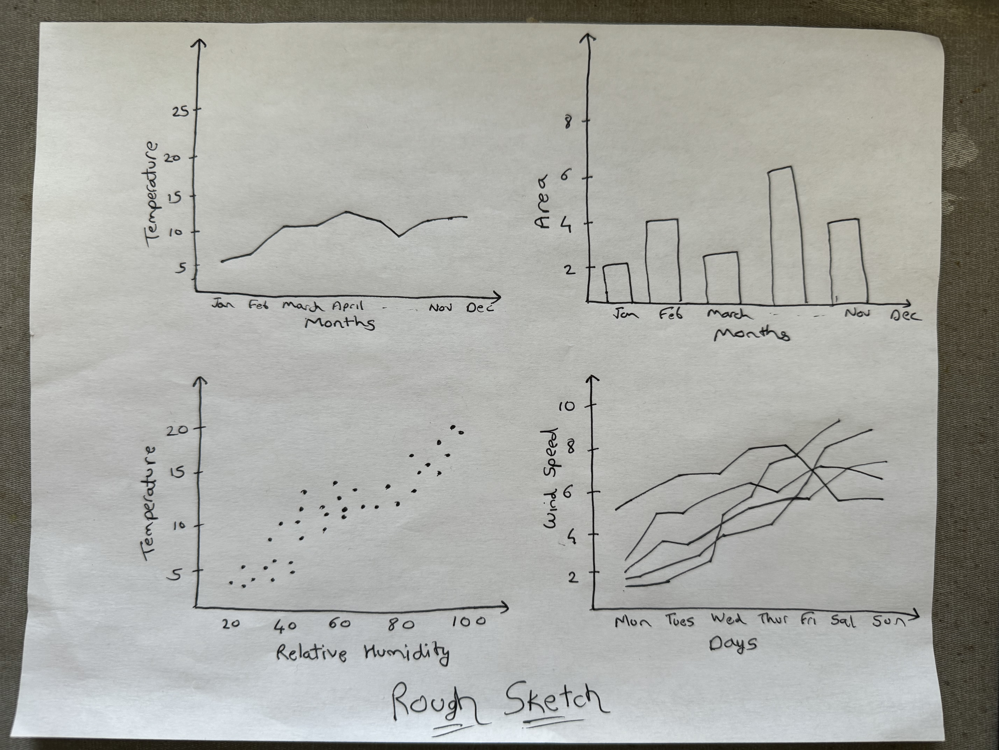

# Data Visualization Project

## Data

The data I propose to visualize for my project is ...


## Questions & Tasks

The following tasks and questions will drive the visualization and interaction decisions for this project:

  
1). Is there a correlation between temperature and relative humidity?    
    
2). Are there interesting spatial patterns in the occurrence of fires?  
  
3). How does the area burned vary across different months?  

4). How does the Fire Weather Index (FWI) components vary with meteorological conditions(temperature, relative humidity, rain, and wind)?


## Sketches




Line Chart (Temperature over Time): Located at the top left, showing how temperature varies over time.

Scatter Plot (Temperature vs. Relative Humidity): Positioned at the bottom of the line chart, illustrating the relationship between temperature and relative humidity.

Bar Chart (Area Burned by Month): Placed on the right side of the line chart, displaying the total area burned for each month.

Line Chart (Average Wind Speed over Time): Situated below the bar chart, depicting changes in wind speed over time.


## Prototypes

I’ve created a proof of concept visualization of this data. It's a ... and it shows ...

[](https://vizhub.com/curran/eab039ad1765433cb51aad167d9deae4)

(please put a screenshot of one or more visualizations of this dataset you already made, for previous assignments, and link to them)

You can put images into here by pasting them into issues.

You can make images into links like this:

```
[](https://vizhub.com/curran/eab039ad1765433cb51aad167d9deae4)
```


Also, you can study the [source](https://raw.githubusercontent.com/curran/dataviz-project-template-proposal/master/README.md) to figure out Markdown formatting. You can use the GitHub built-in editor to edit the document.

## Open Questions

(describe any fear, uncertainty, or doubt you’re having about the feasibility of implementing the sketched system. For example, “I’m not sure where to get the geographic shapes to build a map from this data” or “I don’t know how to resolve the codes to meaningful names” … Feel free to delete this section if you’re confident.)

## Milestones

(for each week, estimate what would be accomplised)
