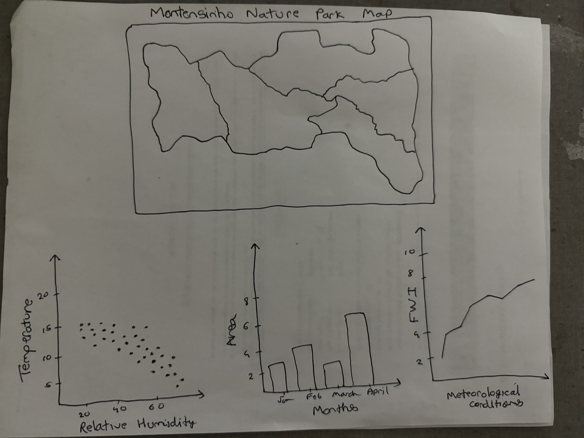
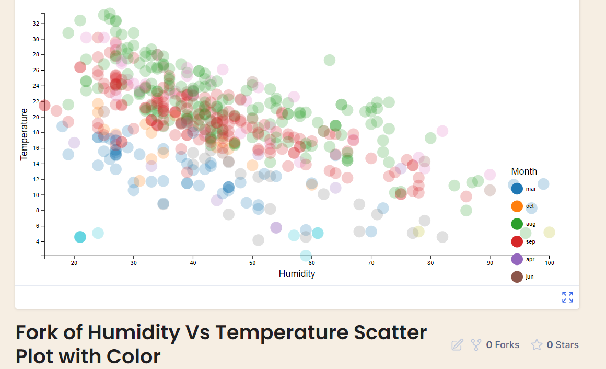

# Data Visualization Project

## Data

The data I propose to visualize for my project is ...

## Questions & Tasks

The following tasks and questions will drive the visualization and interaction decisions for this project:

  
1). Is there a correlation between temperature and relative humidity?    
    
2). Are there interesting spatial patterns in the occurrence of fires?  
  
3). How does the area burned vary across different months?  

4). How does the Fire Weather Index (FWI) components vary with meteorological conditions(temperature, relative humidity, rain, and wind)?

## Sketches

Line Chart (Temperature over Time): Located at the top left, showing how temperature varies over time.

Scatter Plot (Temperature vs. Relative Humidity): Positioned at the bottom of the line chart, illustrating the relationship between temperature and relative humidity.

Bar Chart (Area Burned by Month): Placed on the right side of the line chart, displaying the total area burned for each month.

Line Chart (Average Wind Speed over Time): Situated below the bar chart, depicting changes in wind speed over time.

## Prototypes

The below diagram shows a scatter plot graph and the relationship between humidity and temperature across various months. 

## Open Questions

I'm uncertain about the best method to accurately integrate the Fire Weather Index components into the interactive visualizations. Specifically, how to effectively represent the varying scales of the FWI components (FFMC, DMC, DC, ISI, BUI, and FWI) in a manner that is both informative and accessible to users who may not have a background in meteorology or fire science.

## Milestones

Week 1: Data Preparation and Initial Visualization  
Week 2: Enhancing Scatter Plot and Spatial Pattern Analysis  
Week 3: Development of Temporal Analysis and Interaction  
Week 4: FWI Components vs. Meteorological Conditions  
Week 5: Integration and User Experience Improvements  
Week 6: Final Testing and Project Review
